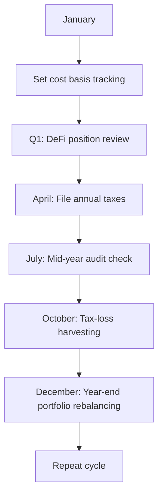

# Cryptocurrency Tax: Essential Guide for Filing

Cryptocurrency investments have surged in popularity, with millions trading assets like Bitcoin, Ethereum, and Litecoin. As digital asset adoption grows, understanding cryptocurrency tax obligations becomes critical for investors worldwide. This comprehensive guide explores tax implications, filing requirements, optimization strategies, and tools to streamline compliance.

## Cryptocurrency Tax Fundamentals

Governments globally classify cryptocurrencies as **taxable property**, similar to stocks or real estate. Key taxable events include:

- **Sales**: Converting crypto to fiat currency
- **Exchanges**: Trading one cryptocurrency for another
- **Payments**: Using crypto for goods/services
- **Mining/Staking**: Earning rewards through network participation
- **Gifts**: Transferring crypto exceeding annual gift limits

### Tax Categories Explained
| Tax Type          | Applicable Scenarios                          | Calculation Method               |
|-------------------|-----------------------------------------------|----------------------------------|
| Income Tax        | Mining rewards, staking, salary payments      | Fair market value at receipt     |
| Capital Gains Tax | Sales, exchanges, disposals                   | Sale price - Cost basis          |
| Gift Tax          | Donating crypto exceeding limits              | Value at transfer date           |

## Global Cryptocurrency Tax Reporting

Tax regulations vary significantly across jurisdictions. Here's how three major economies handle crypto taxation:

### United States
The IRS treats crypto as property under **Notice 2014-21**. Required forms:
- **Form 8949**: Sales and disposals
- **Schedule D (Form 1040)**: Capital gains summary
- **Form 709**: Gift tax reporting

**Audit Tip**: Over 46 million Americans own crypto, and the IRS prioritizes crypto compliance through third-party reporting.

### Australia
ATO applies Capital Gains Tax (CGT) rules:
- **Personal Income Tax Return (IITR)** for reporting
- 50% CGT discount for assets held >12 months
- Detailed record-keeping required for each transaction

### United Kingdom
HMRC guidelines:
- **Self-Assessment (SA100)** for income
- **SA108** for capital gains
- Specific rules for DeFi activities

**Important**: Non-compliance penalties can reach 100% of evaded tax plus interest.

## Strategic Tax Optimization

Implement these proven strategies to minimize crypto tax liabilities:

### Holding Period Optimization
- **Short-term vs Long-term**: Assets held <12 months taxed at ordinary income rates (up to 37% in US)
- **Long-term benefits**: US rates capped at 20%, 15%, or 0% depending on income bracket

### Tax-Loss Harvesting
Offset crypto gains with losses:
1. Sell underperforming assets to realize losses
2. Apply losses against capital gains
3. Carry forward unused losses to future years

**Example**: $10,000 gain + $4,000 loss = $6,000 taxable gain

### Charitable Donations
Donate appreciated crypto directly to qualified charities:
- Avoid capital gains tax on donated amount
- Deduct full fair market value (FMV)
- Max deduction: 30% of AGI for appreciated property

### FAQ: Cryptocurrency Tax Basics
**Q: When does crypto become taxable?**  
A: Taxable events occur when selling, trading, spending, or earning crypto through mining/staking.

**Q: Can I claim crypto losses?**  
A: Yes, crypto losses can offset capital gains and up to $3,000 of ordinary income annually.

**Q: Is crypto taxed if I don't convert to fiat?**  
A: Yes, trading crypto for other crypto still triggers taxable events in most jurisdictions.

## Streamlining Tax Compliance

Managing crypto taxes manually becomes impractical with frequent trading. Consider these solutions:

### Automated Tax Platforms
Leading tools integrate with 800+ exchanges and offer:
- API connectivity
- DeFi/NFT tracking
- Jurisdiction-specific reports
- Audit-ready documentation

👉 [Explore crypto tax solutions](https://bit.ly/okx-bonus)

### Key Platform Features
| Platform      | Supported Countries | Exchange Integrations | Special Features                  |
|---------------|---------------------|------------------------|-----------------------------------|
| Koinly        | 65+                 | 300+                   | DeFi tracking, Margin trading     |
| CoinTracking  | 100+                | 110+                   | 25 report types, Tax-loss tools   |
| Coinpanda     | 65+                 | 800+                   | Free basic reports, NFT tracking  |

## Record-Keeping Best Practices

Maintain meticulous records including:
- Transaction timestamps
- Crypto amounts
- USD equivalent at transaction time
- Wallet addresses
- Purpose of transaction

**Pro Tip**: Use exchange export features to generate CSV files for tax software import.

### Common Reporting Mistakes to Avoid
1. **Underreporting small trades**
2. **Ignoring DeFi activities**
3. **Failing to track cost basis**
4. **Missing gift tax thresholds**
5. **Misclassifying transactions**

## Evolving Regulatory Landscape

Tax authorities intensify crypto oversight:
- **US**: New reporting requirements for brokers (Form 1099-DA)
- **EU**: DAC8 regulation mandates transaction reporting
- **Global**: OECD crypto tax framework implementation

**Expert Advice**: Consult tax professionals specializing in digital assets, especially for complex scenarios involving:
- Cross-border transactions
- Institutional trading
- Crypto-based business operations
- Inheritance planning

👉 [Stay ahead with crypto tax planning](https://bit.ly/okx-bonus)

## Future-Proofing Your Crypto Strategy

As regulations evolve, maintain compliance through:
- **Annual tax planning**: Adjust strategies based on current laws
- **Technology adoption**: Use updated tracking tools
- **Professional networks**: Stay connected with crypto tax experts
- **Education**: Understand emerging trends like CBDC interactions

### Tax Optimization Timeline

## Conclusion
